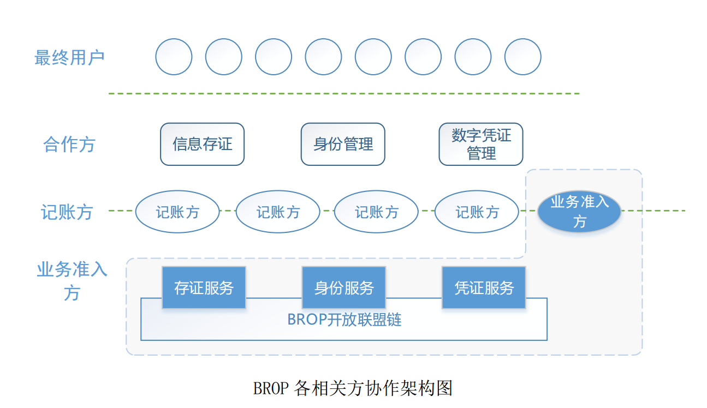
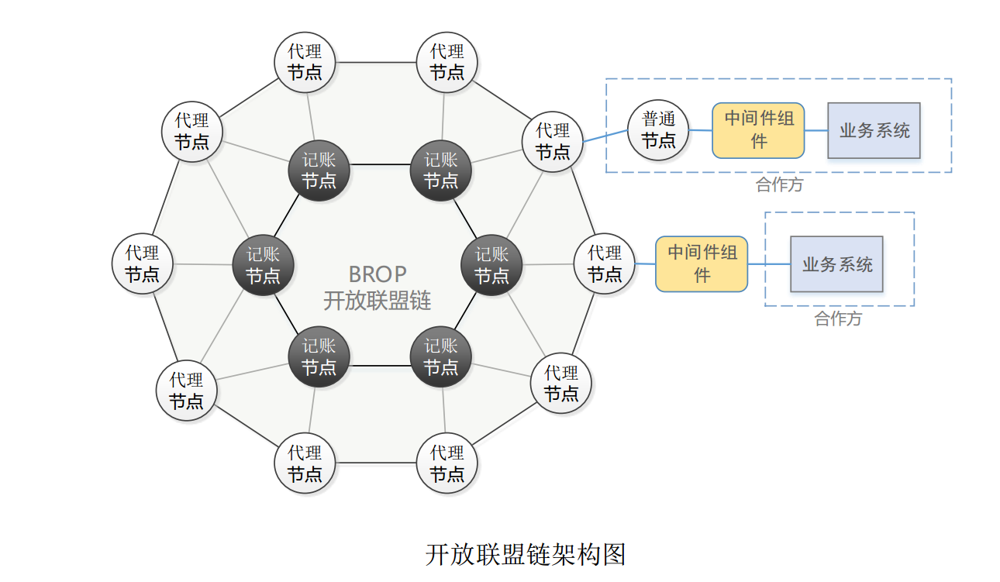

# 中钞可信登记开放平台白皮书

## 目录
- [中钞可信登记开放平台白皮书](#%E4%B8%AD%E9%92%9E%E5%8F%AF%E4%BF%A1%E7%99%BB%E8%AE%B0%E5%BC%80%E6%94%BE%E5%B9%B3%E5%8F%B0%E7%99%BD%E7%9A%AE%E4%B9%A6)
    - [目录](#%E7%9B%AE%E5%BD%95)
    - [1. 概要](#1-%E6%A6%82%E8%A6%81)
    - [2. 区块链与信息登记](#2-%E5%8C%BA%E5%9D%97%E9%93%BE%E4%B8%8E%E4%BF%A1%E6%81%AF%E7%99%BB%E8%AE%B0)
        - [2.1. 传统信息登记平台的问题](#21-%E4%BC%A0%E7%BB%9F%E4%BF%A1%E6%81%AF%E7%99%BB%E8%AE%B0%E5%B9%B3%E5%8F%B0%E7%9A%84%E9%97%AE%E9%A2%98)
        - [2.2. 区块链解决方案](#22-%E5%8C%BA%E5%9D%97%E9%93%BE%E8%A7%A3%E5%86%B3%E6%96%B9%E6%A1%88)
    - [3. BROP 介绍](#3-brop-%E4%BB%8B%E7%BB%8D)
        - [3.1. ★平台概述](#31-%E2%98%85%E5%B9%B3%E5%8F%B0%E6%A6%82%E8%BF%B0)
        - [3.2. ★开放联盟链](#32-%E2%98%85%E5%BC%80%E6%94%BE%E8%81%94%E7%9B%9F%E9%93%BE)
        - [3.3. 中间件](#33-%E4%B8%AD%E9%97%B4%E4%BB%B6)
        - [3.4. ★结构化组件](#34-%E2%98%85%E7%BB%93%E6%9E%84%E5%8C%96%E7%BB%84%E4%BB%B6)
            - [3.4.1. 身份组件](#341-%E8%BA%AB%E4%BB%BD%E7%BB%84%E4%BB%B6)
            - [3.4.2. 存证组件](#342-%E5%AD%98%E8%AF%81%E7%BB%84%E4%BB%B6)
            - [3.4.3. 凭证组件](#343-%E5%87%AD%E8%AF%81%E7%BB%84%E4%BB%B6)
        - [3.5. 配额模型](#35-%E9%85%8D%E9%A2%9D%E6%A8%A1%E5%9E%8B)
        - [3.6. 司法追溯](#36-%E5%8F%B8%E6%B3%95%E8%BF%BD%E6%BA%AF)
        - [3.7. 监管与干预](#37-%E7%9B%91%E7%AE%A1%E4%B8%8E%E5%B9%B2%E9%A2%84)
    - [4. 应用场景](#4-%E5%BA%94%E7%94%A8%E5%9C%BA%E6%99%AF)
        - [4.1. 信息公示](#41-%E4%BF%A1%E6%81%AF%E5%85%AC%E7%A4%BA)
            - [4.1.1. 食品溯源](#411-%E9%A3%9F%E5%93%81%E6%BA%AF%E6%BA%90)
            - [4.1.2. 政企公示](#412-%E6%94%BF%E4%BC%81%E5%85%AC%E7%A4%BA)
            - [4.1.3. 鉴定证书登记](#413-%E9%89%B4%E5%AE%9A%E8%AF%81%E4%B9%A6%E7%99%BB%E8%AE%B0)
            - [4.1.4. 慈善资金登记](#414-%E6%85%88%E5%96%84%E8%B5%84%E9%87%91%E7%99%BB%E8%AE%B0)
        - [4.2. 身份登记与授权](#42-%E8%BA%AB%E4%BB%BD%E7%99%BB%E8%AE%B0%E4%B8%8E%E6%8E%88%E6%9D%83)
            - [4.2.1. 统一身份鉴权](#421-%E7%BB%9F%E4%B8%80%E8%BA%AB%E4%BB%BD%E9%89%B4%E6%9D%83)
            - [4.2.2. 医疗大数据平台](#422-%E5%8C%BB%E7%96%97%E5%A4%A7%E6%95%B0%E6%8D%AE%E5%B9%B3%E5%8F%B0)
        - [4.3. 凭证登记](#43-%E5%87%AD%E8%AF%81%E7%99%BB%E8%AE%B0)
            - [4.3.1. 优惠券登记与流转](#431-%E4%BC%98%E6%83%A0%E5%88%B8%E7%99%BB%E8%AE%B0%E4%B8%8E%E6%B5%81%E8%BD%AC)
            - [4.3.2. 门票登记与流转](#432-%E9%97%A8%E7%A5%A8%E7%99%BB%E8%AE%B0%E4%B8%8E%E6%B5%81%E8%BD%AC)
## 1. 概要
&emsp;&emsp;中钞信用卡产业发展有限公司杭州区块链技术研究院（以下简称“中钞区块链研究院”） **中钞可信登记开放平台** Blockchain-Registry-Open-Platform（下称 BROP） 是一个基于自主知识产权的**开放式可信登记平台**。BROP 通过底层区块链联合各合作方对用户身份、数字凭证和存证数据进行可信记录，为企业用户提供可查询、可验证、可监督的权属登记和信息公示服务。通过 BROP 的服务，各参与方可以将存证信息和数字凭证进行跨机构认证和流转，实现各独立参与方之间的去中心化互信协作。   
&emsp;&emsp;BROP 提供业务无关接口用以信息的可信登记、公示与查询验证。BROP 提供的服务不仅包括信息数据的登记、存证等业务，还包括区块链上的各要素之间实施互动的服务。例如，针对身份与资产相互关系的数字凭证权属变更、针对身份与数据相互关系的认证与授权等。   
&emsp;&emsp;通过 BROP 提供的基础服务，合作方之间可以在互信、互利的基础上实现更广泛和更深入的协作。最终用户也必然获得更加高效、安全和可靠的服务。  

## 2. 区块链与信息登记
### 2.1. 传统信息登记平台的问题 

*  无法自证清白  
&emsp;&emsp;由于所有的数据都存放在平台本身，第三方无法验证平台提供的数据是否被篡改或者是否完整，因此传统的登记平台无法对外证明其数据的可靠性；
*  难以监管  
&emsp;&emsp;由于无法得到可信的数据源，监管方无法对其登记的数据进行有效监管，造成监管黑洞；
*  数据孤岛与业务断层  
&emsp;&emsp;正是因为登记平台无法自证清白，登记平台之间或者登记平台和第三方合作者之间几乎无法进行业务直连，造成业务断层。

### 2.2. 区块链解决方案
&emsp;&emsp;首先，区块链综合采用**数据摘要、信息签名算法**，使得其承载的数据无法伪造**无法篡改**（why?）；同时，区块链数据不再像传统数据库那样由权威方统一保存，而是在每个参与方手里各保存一份数据备份，这样平台方就完全无需自证清白，因为区块链技术保障了登记到区块链上的数据不可能被少数参与方篡改。   
&emsp;&emsp;其次，登记平台的**核心数据**保存在区块链上，并**对用户的隐私进行适当脱敏**。而对于监管方来说它可以随时对业务数据进行调取和验证，无需担心平台方隐瞒或者伪造业务数据。   
&emsp;&emsp;最后，区块链平台方仅仅是规则制定者，平台本身由各参与方共同运营维护，平台数据也是即时推送到各参与方节点中。因此各个参与方可以在统一的规则下相互信任相互协作，从而打破信息孤岛，建立更紧密的新型合作关系。  

## 3. BROP 介绍
&emsp;&emsp;**BROP 平台的设计理念是在`不干涉合作方系统的前提下`为合作方`提供数据的可信证明`**，并在此基础上促进各合作方之间的协作。BROP 平台的设计目标包含如下几个方面。  

*  数据公示  
&emsp;&emsp;我们提供区块链数据登记、存证服务和必要的基础组件，并负责维护数据的完整性、可靠性和可验证性。BROP 平台与合作方系统相对独立，作为合作方数据的可信公示平台。合作方决定其全量核心数据的保存方式，可自行保存，也可托管在 BROP 平台运营方提供的区块链外存储空间。  
*  业务中立  
&emsp;&emsp;数据的业务正确性由数据登记方负责。平台方不为数据的业务正确性、合法性背书，因此数据的使用方需要在信任数据登记方的业务正确性前提下使用数据。  
*  关系自组织  
&emsp;&emsp;我们为平台的参与者提供若干种基础身份，使得他们可以分别完成不同类型的数据登记存证功能。结合区块链智能合约的可编程特征，这些数据和角色可以在平台上实现互信合作。  
*  司法可追溯  
&emsp;&emsp;每一个参与者在进入 BROP 平台之前都会与平台签署并通过本平台公示一份关于其登记数据合法性和有效性的法律文件。该文件将对参与者的登记数据进行法律上的权责约定。一旦某参与者拒绝兑现其登记的数字凭证或提供无法与公示信息匹配的伪造数据，利益相关方有权获得该法律文件并提交司法机构进行仲裁。  
*  开发者友好  
&emsp;&emsp;BROP 平台将提供操作简单但数据完备的平台接入方式，参与方可以在实时获得全量区块数据的同时透过中间件进行简单的接口调用，实现本地业务。  

### 3.1. ★平台概述
&emsp;&emsp;BROP 平台的各参与方包括业务准入方、记账方、合作方和用户方。其中**中钞**作为平台运营方的同时**也是`业务准入方`和`记账方`**，**`业务准入方`负责与`记账方`、`合作方`签约，授权对方在 BROP 平台上开展业务**。**`记账方`由多家企业共同担任，负责对底层开放联盟链的数据进行打包**。**`合作方`一方面接入 BROP 开放联盟链进行身份管理、权属登记和信息存证，另一方面为普通用户提供结合自身特定业务的有价值服务**。所有的参与方都有权部署独立的区块链节点，并同步区块链上的全部信息。考虑到业务简洁性，普通用户一般通过合作方间接访问 BROP 平台。   
&emsp;&emsp;业务准入方为合作方注册并分配身份管理、信息存证、数字凭证发布的权限，**`合作方`对其用户身份信息、链外数据、链外资产或服务进行认证登记`并对其真实性负法律责任`**。合作方之间可以选择认可对方所认证的用户身份，认可之后可以持有对方的数字凭证并进行交易。 
  
&emsp;&emsp;通过该设计，BROP 平台上的各参与方不仅可以共享底层数据库，而且可以共享用户身份信息、数字凭证信息和存证信息。BROP 为参与方之间的相互协作提供了现实可能性。

### 3.2. ★开放联盟链

  

&emsp;&emsp;BROP 的底层是开放联盟链，链内节点分为记账节点、普通节点和代理节点三类。其中，**记账节点**负责将底层开放联盟链的数据打包，由中钞区块链研究院和战略合作伙伴拥有，后续将逐渐引入更多有公信力的战略合作伙伴作为记账节点。**普通合作方则通过在本地架设普通节点或使用云端的代理节点开展业务。** 普通节点和代理节点都能将合作方的数据上链，区别仅是节点所处位置和接入方式不同。对于数据敏感的合作方，可以在本地架设普通节点； 对于数据不敏感的合作方，可以使用由运营方架设在云端的代理节点，并通过开放接口接入，成本更低。这种联盟链结构通过控制记账节点数量保证了共识算法的速度，同时又能支持数量广泛的合作。

**BROP 开放联盟链的技术特色和优势：**  
*  加密机保障安全  
&emsp;&emsp;BROP 记账节点采用定制可选的硬件加密机或虚拟加密机完成记账业务，保障身份安全。
*  性能稳定  
&emsp;&emsp;**BROP 开放联盟链的出块时间在 3 秒左右**，并对区块链容量与智能合约进行了优化，性能可以满足大多数实际应用场景的要求。
*  交易并发与超时确认  
&emsp;&emsp;**传统的区块链交易使用递增序列号作为交易标识**，无法实现业务并发。BROP 开放联盟链使用专利技术，**在发送交易时使用随机数作为序列号并指定超时块高**，实现了业务层面的交易并发和超时确认功能，符合现实业务需求。
*  单块确认  
&emsp;&emsp;BROP 开放联盟链的另一优势是单块确认技术，**不同于传统的区块链最长链选择策略**，BROP 采用新的共识方案保证了区块链不确定性不超过 1 个块高。这使得现实业务落地存在了可行性，**否则区块链一旦分叉，基于过去某个时间点的所有业务都将重置，这在现实业务系统中是不可容忍的。**
*  开发工具完整  
&emsp;&emsp;我们提供区块链节点部署包、中间件工具包以及示例代码，使得区块链的接入和开发难度大大降低。开发人员只需要关注中间件的业务接口即可，无需了解背后的复杂技术。同时我们提供节点云部署的可选方案，使得开发者可以更快速度接入并测试 BROP 服务。
*  ★共识可靠  
&emsp;&emsp;由于存在单块确认的特性，参与方无需担心普通节点的业务安全性。**与比特币的非确定性出块不同，只要合作方收到了打包回执，即可证明业务已经被全网确认且之后不会被记账节点处于恶意或软件错误而推翻**，**因此合作方无需掌握记账节点以提高自己的业务安全性（不敏感数据可以用云端代理结点）**。记账节点需要提供大量运算资源和网络带宽，由 BROP 运营方和战略合作伙伴负责提供相应的经费。

### 3.3. 中间件
&emsp;&emsp;为了便于合作方访问区块链数据，我们提供了中间件组件。业务系统通过接口调用的方式使用中间件，极大的简化了合作方接入区块链平台的方式，减少了学习成本和开发成本。其主要解决的问题包括以下几个方面：  
*  数据检索  
&emsp;&emsp;区块链以 key-value 的形式保存数据，只能根据区块 id 进行块内检索，无法根据业务字段进行查询。中间件为了实现对区块链上数据的结构化查询，对上链的数据维护了业务字段与区块链数据结构之间的对应索引，使业务系统无需处理区块链底层的数据检索逻辑，能够实现数据库级别的查询方式。   
*  事件通知  
&emsp;&emsp;区块链通常没有事件通知机制，业务系统无法得到区块链网络中的变更反馈。中间件定义了一系列事件类型并对其进行追踪，如区块链增长事件、交易上链事件、合约数据变更事件等。业务系统只需选择自己所关心的事件，接收相关业务数据的消息推送。 
*  数据上链  
&emsp;&emsp;将数据提交到区块链上，需要多个步骤。中间件封装了所有和底层链相关的操作，业务系统只需要关心待上链数据和数据签名。  

### 3.4. ★结构化组件
&emsp;&emsp;BROP 结构化组件的作用是通过智能合约对存证数据进行结构化分类并给予可编程的操作接口，使得这些数据在面临具体的业务背景时可以相互关联和相互作用。
#### 3.4.1. 身份组件
&emsp;&emsp;**BROP 上的`账户身份`特指经过认证过的`用户账户智能合约`**，它并不是指具体业务中与用户的访问权限、业务角色等绑定的业务身份。**用户账户身份认证由合作方自行负责，BROP 仅对认证结果作数据存证**。考虑到业务便利性，BROP 系统为每一个用户账户地址分配一个系统账户 ID，并且可选将经过身份认证的名称或自定义名称设定为账户名。   
&emsp;&emsp;身份组件一方面向合作方提供身份认证接口，一方面为用户账户提供区块链交易操作接口。其主要功能包括以下几个方面：  
*  身份证明  
&emsp;&emsp;每一个用户账户智能合约都有与之对应的经过合作方认可的身份信息，该信息以身份证明的形式存在于区块链上，标志着对应的用户经过了合作方认可。     
&emsp;&emsp;身份证明的存证有两个意义：第一是免于第三方进行重复的身份确认；第二是当用户出现违规可以通过合作方得到其真实信息进行司法追索。     
&emsp;&emsp;考虑到用户的身份隐私，其相应的身份明文信息仅以摘要形式存在于区块链上，合作方则记录完整信息。当第三方需要对用户的身份信息鉴别时，第三方可根据用户自行提交的身份信息来计算摘要，并通过与区块链上的存证信息对比以确认用户身份。   
*  交易许可  
&emsp;&emsp;合作方对用户进行的身份认证可能有数字证书（具法律效果）、普通实名、匿名、手机号验证、仅登记等多种级别，不同认证级别对应不同的区块链交易权限。   
&emsp;&emsp;与公有链不同，BROP 开放联盟链不允许匿名账户拥有数字凭证。能够发起数字凭证交易的地址必须经过实名身份认证，所有接受数字凭证的地址也必须经过实名身份认证。   
&emsp;&emsp;在合作方愿意为匿名账户的上链内容负责的情况下，匿名账户可以在 BROP区块链上发起信息存证交易。没有经过任何认证的账户则只能进行查询。 
&emsp;&emsp;BROP 区块链上每个合作方都可以对交易账户认证，交易账户记录对其认证的合作方的索引及被合作方认可的认证级别。具体的上层业务可以拒绝为那些自己不认可的合作方认证的账户及合作方认可但认证级别不过关的账户进行服务。  
*  密钥管理  
&emsp;&emsp;合作方对用户进行身份认证时即生成了一个用户合约，该合约是后续区块链业务的交易载体，用户持有的密钥是该用户合约的操作钥匙。如果用户持有的密钥丢失，可以提供必要的身份证明向合作方申请密钥重置。密钥重置后，用户合约的地址和持有的数字凭证不变，变化的仅是用户持有的操作钥匙。   
&emsp;&emsp;**为了防止合作方管理人员滥用职权伪造用户意愿修改合约密钥造成纠纷，BROP 身份组件要求在每一次重置用户密钥时，合作方都必须将本次修改涉及到的用户的申请材料和认证材料在 BROP 上存证。如果合作方无法提供用户的申请与认证资料，或者资料与 BROP 上的存证信息不符，则说明该合作方存在法律责任。**  
*  身份监管  
&emsp;&emsp;应权威监管机构要求，合作方可以向其提供所有其认证的用户身份的明文信息，权威监管方可以将其与区块链存证信息匹配鉴别。BROP 运营方并不强制要求合作方向其提供用户的身份信息。

#### 3.4.2. 存证组件
&emsp;&emsp;**存证组件用来由合作方向业务第三方提供信息公示、数据存证服务**。**`合作方负责其存证数据的真实性，BROP 负责其完整性和可靠性`**。**业务第三方则自行决定对合作方是否信任**。存证组件提供了一系列标准化的数据证明手段以实现信息公示。我们将提供完善的技术工具方便应用方将数据验证组件与自己的应用整合，同时提供数据公示网站和接口供用户查询。  
*  时间证明  
&emsp;&emsp;BROP 上存在两类时间戳，一类是区块本身的时间戳，它由记账节点打包时提供本机时间并交由其他节点共识确认；第二类是可信授时机构提供的时间戳签名。根据业务需求和法律要求的不同，合作方可以对其存证数据附带这两种形式的时间证明。  
*  可靠性证明  
&emsp;&emsp;数据的可靠性证明解决的是数据如何防篡改的问题。合作方将存证对象的数据摘要存放在 BROP 平台上，验证方可以将数据原文进行摘要后与 BROP 平台上登记的摘要信息对比，以确认数据的可靠性。  
*  完整性证明  
&emsp;&emsp;针对同一个对象可能存在多条前后关联的数据记录，我们提供多条数据的完整性证明机制，其典型的场景是**食品溯源和库存流转**等。具体的实现形式是通过业务上具有关联关系的数据通过包含上一条信息的摘要的形式进行前后关联。任何一条记录的丢失或者篡改都无法通过区块链验证。  
*  多方确认证明  
&emsp;&emsp;该功能提供某一数据已经同时获得多个参与方的确认的证明，主要的应用场景是多方**电子合同的签署**。**当且仅当多个参与方均确认时合同文件才能生效，在其他参与方确认之前，已确认的参与方随时可以撤销确认。**
*  数据托管  
&emsp;&emsp;针对合作方可能需要保存与区块链存证数据相关联的文件（如图片），我们提供数据托管服务，将文件保存在云端存储空间，并在区块链上保存了托管地址摘要。合作方可自行选择文件保存方式，BROP 对数据托管服务按照存储空间大小额外收费。

#### 3.4.3. 凭证组件
&emsp;&emsp;**数字凭证特指与链外实物、虚拟商品或某种服务对应的权属记录**。每种数字凭证由特定的合作方负责注册和登记，并由该合作方负责兑现相应的产品和服务。    
&emsp;&emsp;数字凭证的登记方需要符合国家对凭证登记和交易的相关要求，对于不能进行公开交易的凭证，如未经许可的债券、股权等与现行法律相抵触的凭证不得在 BROP 平台上注册登记。**否则因此造成的一切后果由注册登记方负责。**BROP**仅负责数字凭证的结构化记录和权属变更的原子性，不负责其法律的合规性，也不对数字凭证对应的产品或服务进行价值背书**。   
*  凭证注册  
&emsp;&emsp;合作方提供数字凭证的相关信息，包括数字凭证名称、对应服务（或产品）、数字凭证类型（是否可拆分合并）、数字凭证数量上限等，由 BROP 运营方创建对应的数字凭证智能合约，交由合作方管理。  
*  凭证分配  
&emsp;&emsp;合作方可以根据自己的业务需求在发行数量允许的范围内向已经经过身份认证的用户进行数字凭证分配。持有该数字凭证的用户可以将其权属转让给他人。  
*  凭证确权  
&emsp;&emsp;数字凭证的持有人有权将数字凭证转移给数字凭证发行方认可的 BROP 账户名下，且该权属变更由区块链确认并公示。因此交易中介可以与数字凭证发行方通过 BROP 区块链协作以提高数字凭证的流动性。     
&emsp;&emsp;通过这种形式，数字凭证发行方和交易中介这两家企业实现了数据互通和业务协作，为用户提供了可靠、便捷的服务。   
*  凭证监管  
&emsp;&emsp;**合作方发行的数字凭证对应其承诺的产品或服务**，因此不得超过其承担能力。监管方可以对其资产能力进行评估并对其数字凭证发行上限、发行模式和流通行为进行监管。具体的监管手段包括报表统计、发行量上限调整、流动性限制等。   
*  凭证证明  
&emsp;&emsp;当用户需要对数字凭证进行交易时，**其数字凭证需要在`中心化服务的交易所`进行托管**，`此时有可能存在交易所恶意转移用户的数字凭证的情况发生`。BROP 平台提供凭证证明接口，交易所调用该接口可以**生成基于 Merkle 树算法的凭证证明信息，为其凭证托管提供 100%数量证明（不明白？通过Merkle树来验证交易所托管的凭证是否是平台上的凭证，若是则没有篡改，并且无需知道平台上的其他凭证数据？）**。**业务系统也可以调用该接口对资产证明进行验证**。

### 3.5. 配额模型
&emsp;&emsp;与以太坊平台引入 GAS 机制的原因类似，BROP 必须引入配额模型才能规避恶意用户的零成本交易攻击。本配额模型特指用户使用 BROP 需要付出的代价的计量方式，尽管可以作为参考但并非具体的商业收费模型。   
&emsp;&emsp;由于 BROP 不允许用户自行部署智能合约，因此无需引入类似以太坊的按照OPCODE 计算的 GAS 系统。BROP 仅针对交易量和数据量两项对平台负载影响较大的性能指标进行配额管理。配额管理即为配额的分配和消耗机制，配额的分配机制只是为了补充消耗的计算配额，故可实行简单的周期性恢复，后续可实现更复杂的分配策略。

*  配额单位  
&emsp;&emsp;BROP 以配额点的形式对交易复杂度进行度量，该配额点仅供发起区块链交易所占用的计算资源的计量使用，不具备转账、交易等功能，同时也不符合总量不变或增量确定等数字货币的特征。
*  配额点数分配  
&emsp;&emsp;通常情况下平台的交易由合作方完成，因此各合作方是配额点数的主要消耗者；同时终端用户也存在发起交易业务的情况，因此终端用户也会在某些情况下存在配额点数需求。   
&emsp;&emsp;BROP 将向各个合作方周期性地分配一定数量的配额点数。终端用户也会根据业务上限周期性获得系统分配的配额点数，如果某用户恶意发起大量碎片交易其配额点数很快会消耗完。  
*  交易配额计量  
&emsp;&emsp;**每次交易发起时，交易方需要向系统支付预定数值的配额点数。交易所需的配额点数与交易复杂度和附带数据量有关。配额点数不足时，记账节点拒绝该交易打包。**   
&emsp;&emsp;注： BROP 提供链外数据托管服务，其服务存放的数据量与链上配额点数无关，不在本白皮书的讨论范围内。  

### 3.6. 司法追溯
&emsp;&emsp;每一个参与者在进入 BROP 平台之前都会与平台签署并通过本平台公示一份关于其登记数据合法性和有效性的法律文件。通过该法律文件的设计，我们可以要求用户对 BROP 开放联盟链上的每一个操作担负对应的法律责任。这些法律声明包括但不限于公示身份的真实性、登记数据的真实合法性、登记数字凭证的合法性、权属转移的合法性等。   
&emsp;&emsp;通过对参与方的业务行为的法律约束，以及对其业务结果的连带责任的约束，我们可以在 BROP 开放联盟链上形成一个法律责任链条。一旦参与方在BROP 平台中某一个操作步骤出现了法律纠纷，参与方有权获得完整的法律责任文件，并对责任方执行司法追溯。    

### 3.7. 监管与干预
&emsp;&emsp;BROP 平台在运行过程中会遇到多种需要人工干预的场景，我们将它分为三类：    
&emsp;&emsp;一是权威监管机构（如司法部门）发出具有法律效应的监管命令，该命令针对某一参与方，则由中钞执行该命令，同时将对应的法律证明保存到 BROP 区块链上；  
&emsp;&emsp;二是针对平台的技术性需求，如系统功能升级或紧急补丁，由各记账方商议后进行决策；   
&emsp;&emsp;三是权威监管机构发出的针对普通用户的命令，由该用户对应的合作方负责监管与执行。  

## 4. 应用场景
&emsp;&emsp;BROP 平台的应用场景主要包括两大方面，**`信息公示（存证）`**和**`资产登记（凭证）`**。前者将静态信息公示在平台上用来**对合作方的信息提供存在性、完整性和未篡改的证明**。后者则将权属信息登记在平台上，通过**权属的可信变更和查询**来**实现资产登记方、交易方和验证方的多方协作**。

### 4.1. 信息公示
#### 4.1.1. 食品溯源
&emsp;&emsp;场景痛点：食品从生产到销售环节众多，每个环节产生的各类信息被离散地保存在各个环节各自的系统内，信息流缺乏透明度。这带来的问题是： 食品信息因为生产、流通信息不透明、不流畅导致出现造假可能（如曾经出现过的生产日期超前于销售日期），最终消费者难以通过现有信息确认食品的品质。   
&emsp;&emsp;基于 BROP 的解决思路： 通过数据摘要和信息签名算法，使得其承载的数据无法伪造无法篡改来有效解决食品的溯源问题。具体的实现形式是**食品溯源企业将食品身份认证及流转过程记录在本地服务器，并将其数据摘要上传至 BROP 平台**。其中，**业务上具有关联关系的数据通过包含历史信息摘要的形式在数学上进行前后关联**。这样食品的`生产记录、运输记录、分销记录、零售记录`都会被有关联并忠实的记录在区块链上。当第三方需要对溯源数据进行读取时，食品溯源企业提供相应的详细信息，**第三方只需将其与 BROP 平台上的摘要信息进行对比，即可判断数据的真实与完整**。

>这样就能真的查到食品的生产日期么？如果食品生产商登记的时候就作假呢？就好比登记的生产日期超出实际生产日期，就像前面提到的存证、凭证，要由第三方来保证数据合法性，这本身就是得不到保证的。

#### 4.1.2. 政企公示
&emsp;&emsp;场景痛点： 互联网科技的发展使得越来越多的政府和企业使用互联网进行公示公告，促进服务的高效、精准和便利，但是在增加便利性的同时，保障数据的安全以及应对数据量的海量增长成为亟待解决的问题。   
&emsp;&emsp;基于BPOR的解决思路： 政企公示服务公司将相关**核心数据的标号**和**脱敏摘要**保存在区块链上，当第三方需要对公示数据进行读取时，政企公示服务公司提供相应的详细信息，第三方只需将其与BROP平台上的摘要信息进行对比，**即可判断数据的真实与完整**。

>难道政府公示的数据还作假？

#### 4.1.3. 鉴定证书登记
&emsp;&emsp;场景痛点：传统的鉴定证书管理**依赖相关政府或检测检验单位**，而有限的数据维度、**未建立的历史数据信息链**常常导致无法获得完整有效的信息或者对鉴定证书的本身的真伪无法判断的问题。   
&emsp;&emsp;基于BROP的解决思路： 充分利用区块链建立不可篡改的数字化证明，**将经由鉴定机构鉴定过的物品或资质的证书编号和证书图片的摘要信息登记到平台上**。其他用户可以通过鉴定机构的平台查询到该登记信息并与区块链上的信息进行比对确认信息真实性。更进一步的服务还包括将登记的商品由合作方托管并将权属信息登录在BROP平台上，则用户可以在交易市场直接对其权属进行交易，这大大促进了鉴定物品在交易市场的流动性。

>平台只能保证登记信息不被篡改，但是鉴定过程还是需要鉴定机构啊，并没有解决什么痛点啊？

#### 4.1.4. 慈善资金登记
&emsp;&emsp;场景痛点：信息不透明，公众无法追溯捐助的钱款、物资如何是使用的。在过去几年里公益慈善行业爆发出的事件，极大地打击了公众对公益行业的信任度。公益信息不透明不公开，是社会舆论对公益机构、公益行业的最大质疑。公益透明度影响了公信力，公信力决定了社会公益的发展速度。   
&emsp;&emsp;基于 BROP 的解决思路： 公益机构将公益流程中的相关信息，如**捐赠项目、募集明细、资金流向、受助人反馈等信息的`摘要`**存放于区块链上进行。与溯源登记类似，第三方可以结合公益机构提供的全量信息进行数据鉴定。此外，通过 BROP 平台提供的全量资金证明工具，公益机构可以在 BROP 联盟链上证明**所用用户捐赠的善款都已经包含在公示信息内**，大大提高公益透明度。

>1.存的还是摘要，如果验证后数据被篡改了，那么原数据也无法获得啊？
>2."所用用户捐赠的善款都已经包含在公示信息内" 还是用零知识证明？还是那句话，如果一开始登记的数据

### 4.2. 身份登记与授权
#### 4.2.1. 统一身份鉴权
&emsp;&emsp;场景痛点：目前尚不存在一个公用的身份鉴权平台，**各个应用方无法对第三方背书的身份信息完全认可**；监管方也很难在跨应用前提下对不同的用户的征信信息、资产信息进行评估。   
&emsp;&emsp;基于 BROP 的解决思路： 某**身份认证机构**对个人用户和企业用户进行链外KYC，对其身份信息进行**摘要存证**；合作方选择信任该身份认证机构，**当合作方需要了解该个人用户的身份信息时**，该身份认证机构在用户同意的前提下将用户的身份信息发送给合作方（类似微信登录的第三方授权服务），合作方通过将该信息与区块链上的存证摘要进行比对即可确定用户信息的真实性。同时，**用户可以选择将其在 BROP 区块链上的所有数字凭证和`交易信息`都发送给监管方或合作方，以提供其征信信息。**

>KYC规则是指了解客户(know-your-customer, KYC)规则 [1]  。金融机构如不能清晰识别客户身份，便更不愿贷款给客户，阻碍金融普惠，是国际社会努力实现金融诚信和金融普惠不可或缺的。

>摘要存证…… 可能用这个平台查征信更加方便了吧。

#### 4.2.2. 医疗大数据平台
&emsp;&emsp;场景痛点： 个人用户的医疗信息分散在各家医院，**医院不能在未经许可前提下分发用户的隐私数据**；但是又需要对用户的医疗数据进行聚合以便对用户的身体状况进行综合分析。   
&emsp;&emsp;基于 BROP 的解决思路： 用户使用 BROP 上的统一身份去注册或关联医院的患者 ID，**各家医院作为 BROP 上的数据共享节点将用户的`就诊信息加密保存`**。**用户授权某家医疗机构访问其就诊数据后，该医疗机构使用用户私钥签名后的授权请求获取指定用户的原始就诊信息**。即可完成医疗大数据的可信分享。

>相当于统一的医疗平台，但是感觉不用区块链也可以。

### 4.3. 凭证登记
#### 4.3.1. 优惠券登记与流转
&emsp;&emsp;场景痛点： 传统的纸质或电子优惠券作为商家促销的最有效手段之一，目前存在流动性不足的问题。很多优惠券发放以后未被使用，未能在获取新用户过程中发挥积极作用。   
&emsp;&emsp;基于 BROP 的解决思路：优惠券发行方可以在区块链上将自己的**产品或服务作为数字凭证发布**，个人用户购买或被赠与相应的数字凭证后可以非常方便地到第三方网站进行权属转移，从而解决数字凭证二级市场流动性不足的问题。

#### 4.3.2. 门票登记与流转
&emsp;&emsp;场景痛点： 门票作为一种由票务方发行、由分销商销售的有价凭证，可以看作是以主办方的某项服务为抵押的资产凭证。活动主办方授权销售方进行票务销售，销售方通过多渠道、多级市场交易后，票务确权发生困难。主要原因一是主办方无法追踪及控制多渠道、多级市场以后门票的情况；二是主办方收到票款后也没有动力去追溯。   
&emsp;&emsp;基于 BROP 的解决思路： 实现门票流转规则的制定、门票所属权的登记和门票所属权的流转等功能。借助区块链技术的公开性、可监管、可验证、不可伪造和不可篡改等特性，平台上登记的数字门票所属权明确，转移过程透明，因此可以使得票务领域各个公司基于该所属权进行各种业务合作。用户购买门票后也可以方便地进行转移。